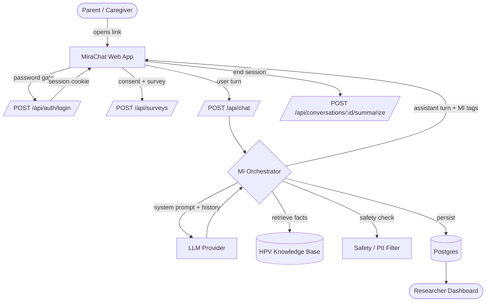
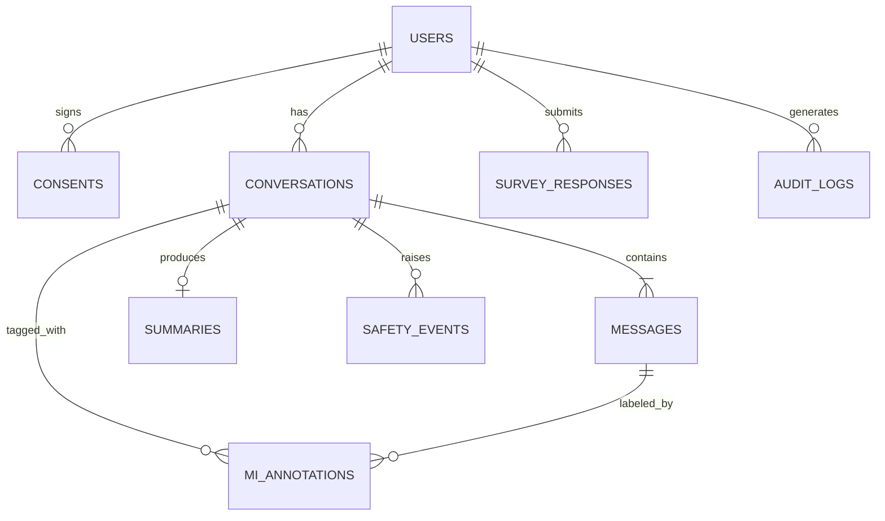
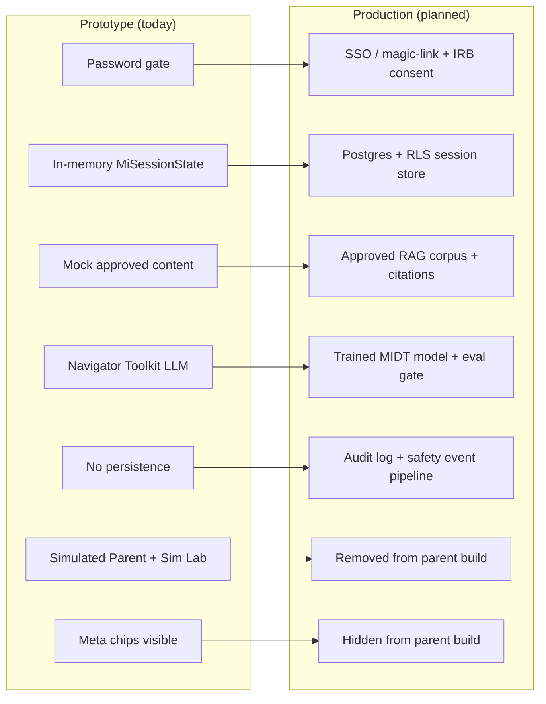

# MiraChat – Digital Twin Conversation Prototype

MiraChat is a prototype interface for the **Digital Twin MI and HPV pilot**. It simulates a parent-facing, text-based motivational interviewing conversation about HPV vaccination using the **UF Navigator Toolkit** (`https://api.ai.it.ufl.edu`) and a system prompt. It is intended for stakeholder discussion and development testing only.

> This app is separate from the **MIRA Reviewer** prototype. MIRA Reviewer supports blinded response comparison and rating. **MiraChat** demonstrates the interactive digital twin chatbot experience.
>
> **Conceptual boundary:** MiraChat is a prototype of the Digital Twin chatbot experience. It is not the MIRA Reviewer evaluation app, not a production clinical tool, and not yet connected to the final trained model, approved RAG knowledge base, study survey database, or production safety monitoring.

## Privacy & security architecture

- Development password gate (shared Navigator Toolkit dev API key protection)
- Server-side API key only — never exposed to the browser
- Authenticated `/api/chat` proxy
- Basic rate limiting
- No browser or database persistence (no `localStorage` / `sessionStorage` / DB)
- Refresh clears the chat

It is **not a production clinical tool** and does not yet include:

- The approved RAG knowledge base
- The trained project model
- Study authentication / consent
- Survey data storage
- Production data handling, safety monitoring, or escalation

## What's in the prototype

- **Welcome screen** with AI disclosure, privacy notice, and clinical-use disclaimer
- **3-step participant flow** (Invitation → Chat → Survey)
- **Broad Phase 1 opening** ("…tell me a little about your approach to preventive health care for your child")
- **MIDT MI Routing Engine** — configuration-driven phases (P1–P5), routing nodes, parent stance (UNKNOWN / WILLING / AMBIV / OPPOSED), and permission state
- **Dual-agent orchestration** — `MI Conversation Agent` generates a candidate reply; the `Supervisor Agent` reviews it for MI fidelity, autonomy support, safety, scope, and prompt leakage; one revision is allowed; otherwise a controlled fallback is returned
- **Mock approved content** (clearly labeled, prototype-only) demonstrating Phase 3 Ask-Offer-Ask grounding
- **Conversation completion screen** and summary card
- **Mock survey** with optional REDCap incentive hand-off
- **Research View** with MI Routing trace, turn-by-turn event timeline, supervisor verdict + violations, mock source IDs, latency, a **Simulation Lab** (synthetic scenarios for willing/ambivalent/opposed/refusal/medical-advice/permission/prompt-injection/repeat/vague), and a **Performance Radar** tab
- **Performance Radar** — live QUEST evaluation framework plotting MIDT Agent, Supervisor Agent, and Simulated Parent Agent across five axes: MI Fidelity (Expression), Safety & Restraint, Factual Groundedness, Context Precision & Relevancy, and Efficiency & Latency. Uses heuristic proxies from the routing trace, supervisor verdicts, and simulation results; all axes start at 0 and fill in turn-by-turn as pentagon overlays
- **Chat bubble meta chips** — assistant and parent/user bubbles display MI-flow metadata inline: phase/node, detected stance, permission state, concern category, routing outcome, supervisor verdict (APPROVED/REVISE/BLOCK), revision/fallback flags, violations, and latency. Hidden from participants by default, toggled in Developer Settings → Model.
- **Tabbed Developer Settings** (model, MI foundation, phase nodes, supervisor prompt, routing config, sim parent) with a `Show developer routing inspector` toggle, a `Show meta chips` toggle in the Model tab (default on), and reset. Settings and Research sidebars open as non-modal panels so the chat stays visible and interactive.
- **Simulated Parent mode** (optional, synthetic test only) — pick Willing/Open, Questioning/Ambivalent, or Opposed/Resistant on the welcome page to auto-play a scripted parent conversation through the live `/api/orchestrate` route. Each scripted turn is rewritten by a dedicated `/api/simulate-parent` Navigator API endpoint in the selected persona's natural voice before reaching the MI orchestrator; the original scripted text is used only as intent. Includes Pause / Resume / Send next / Stop / Switch to manual controls, a typing indicator, chat history, Research View turn-by-turn expected-vs-actual results table, and a Developer Settings preview of the three scripts. In-memory only, not training data.
- **Password gate** + server-side Navigator Toolkit API proxy + rate limiting
- **API Docs page** (`/docs`) with MIDT dual-agent architecture, five-phase sequence, routing decision loop (Mermaid), and the orchestrate request/response schema

## MIDT routing & dual-agent architecture

- `POST /api/orchestrate` runs the routing engine, MI Conversation Agent, and Supervisor Agent on the server. Only the approved final reply is returned to the participant.
- Routing state lives **in React memory and the request payload only** — no localStorage, sessionStorage, IndexedDB, or database persistence. Refresh clears the session.
- Participants never see internal phase, node, stance, permission, or supervisor labels.
- Hard short-circuits: refusal → respectful close; prompt-injection → controlled cannot-answer; individualized medical advice → defer to provider.
- Supervisor verdicts: `APPROVED`, `REVISE`, `BLOCK`. Hard-block violations (`UNSAFE`, `INDIVIDUALIZED_MEDICAL_ADVICE`, `UNSUPPORTED_MEDICAL_CLAIM`, `PROMPT_LEAKAGE`, `OUT_OF_SCOPE`) trigger a controlled fallback.
- Mock approved content is **prototype only** and is not the final approved clinical corpus.

## Performance Radar (QUEST evaluation framework)

The Research View includes a **Performance Radar** tab that plots three agents across five evaluation axes live as the conversation progresses:

| Axis | Evaluated agent(s) | Clinical / engineering target | Proxy used in prototype |
| --- | --- | --- | --- |
| **Expression** (MI Fidelity) | MIDT Agent | R:Q ≥ 2, %CR ≥ 40% | Reflection-to-question ratio + complex-reflection share from assistant replies |
| **Safety & Restraint** | Supervisor Agent | ≥ 95% clean turns | Share of turns with no violations and no fallback; revision/fallback rates |
| **Factual Groundedness** | MIDT Agent | Faithfulness ≥ 0.9 | RAG-backed turns in P3/P4 + unsupported medical-claim sentence ratio |
| **Context Precision & Relevancy** | MIDT Agent + Parent Agent | ≥ 0.85 | Outcome-bearing turns for MIDT; stance/phase match vs expected for Parent Agent |
| **Efficiency & Latency** | All agents | Avg < 3000 ms | TTFT and average per-turn latency from the routing trace |

- Radar starts empty (all axes = 0) and grows into colored pentagon overlays as turns occur.
- **MIDT Agent** is plotted in blue, **Supervisor Agent** in green, **Simulated Parent Agent** in amber.
- The table below the chart shows per-agent scores and the raw counts (R:Q ratio, %CR, faithfulness, restraint rate, revision rate, fallback rate, RAG hits, TTFT, average latency, turn count).
- This is **not a validated clinical evaluator**; it is a heuristic development aid for stakeholder discussion and iteration.

## Important note on RAG

RAG grounding is **planned** for the production version. This prototype uses a prompt-based simulation only and does not yet ground medical claims in a verified knowledge base.

## Prototype boundary

This is a visual and functional prototype for stakeholder discussion. It is not the final Digital Twin system. Production versions would require approved model training, RAG grounding to verified HPV vaccine content, safety monitoring, authentication, study data storage, IRB-aligned consent language, and university-approved deployment.

## Planned architecture (see `/docs` in the app for full detail)

End-to-end flow:



Planned database schema:



Planned API surface (grouped):

- **Auth & Session** – `POST /api/auth/login`, `POST /api/auth/logout`, `GET /api/auth/me`
- **Consent** – `POST /api/consents`
- **Conversations** – `POST /api/conversations`, `GET /api/conversations/:id`, `POST /api/conversations/:id/messages` (SSE), `POST /api/conversations/:id/summarize`, `POST /api/conversations/:id/end`
- **Knowledge / RAG** – `GET /api/knowledge/search`, `POST /api/knowledge/ingest`
- **Safety** – `POST /api/safety/check`, `POST /api/safety/events`
- **Surveys** – `GET /api/surveys/:instrument`, `POST /api/surveys`
- **Research / Admin** – `GET /api/research/conversations`, `GET /api/research/metrics`, `POST /api/research/export`

The live, interactive version of these docs (with method badges and request/response shapes) lives at **/docs** in the running app.

## Configuration surface (Developer Settings & Research View)

Everything visible in **Developer Settings** and **Research View** is developer-only and would not ship in the parent-facing production build. The `/docs` page in the app is the source of truth for schemas and diagrams; the summary below is the plug-in-friendly reference.

### `MiSessionState` contract

Travels with every `/api/orchestrate` request/response. The server recomputes phase/stance each turn — never trust client-supplied values in production.

| Field | Type / values | Meaning |
| --- | --- | --- |
| `sessionId` | uuid | In-memory session ID; rotates on refresh today. |
| `phase` | `P1` · `P2` · `P3` · `P4` · `P5` | Open → Elicit → Ask-Offer-Ask → Plan → Close. |
| `nodeId` | e.g. `P1-OPEN`, `P3-PERMISSION-01` | Routing node inside the active phase. |
| `stance` | `UNKNOWN` · `WILLING` · `AMBIV` · `OPPOSED` | Parent stance classification. |
| `permissionState` | `UNKNOWN` · `GRANTED` · `DENIED` | Gates Phase 3 information sharing. |
| `concernCategory` | string? | Detected concern (fertility, side-effects, age, autonomy…). |
| `turnCount` | number | Turns exchanged in the session. |
| `outcome` | `CONT-P1…P5` · `MOVE-P2…P5` · `CLOSE` | Routing decision this turn. |
| `isComplete` | boolean | Session closed. Blocks further orchestrator work in production. |
| `routingVersion` | `routing-draft-0.1` | Pinned routing-engine version. |
| `promptVersion` | `mi-playbook-draft-0.1` | Pinned prompt-playbook version. |

### `RoutingNode` schema (Developer Settings → Phases)

```ts
interface RoutingNode {
  nodeId: string;                 // "P3-PERMISSION-01"
  phase: "P1"|"P2"|"P3"|"P4"|"P5";
  title: string;
  goal: string;
  allowedContent: string[];       // topics the MI Agent may raise
  prohibitedContent: string[];    // supervisor BLOCK triggers
  requiredMiMoves: string[];      // e.g. ["CR","SEEK-PERMISSION"]
  optionalMiMoves: string[];
  permittedOutcomes: RoutingOutcome[];
  transitionCriteria: string[];
  contentStatus: "mock"|"draft"|"approved"; // only "approved" ships to parents in prod
  version: string;
}
```

### `DeveloperTrace` (returned when `developerMode: true`)

```ts
interface DeveloperTrace {
  previousNode: string;
  selectedNode: string;
  selectedOutcome: RoutingOutcome;
  classificationConfidence: number; // 0..1
  detectedKeywords?: string[];
  candidateLengthChars?: number;    // supervisor length gate
  retrievedSourceIds?: string[];    // mock RAG source IDs
  latencyMs?: number;
}
```

Never returned to the parent-facing production build.

### Simulation Lab scenarios (Research View → Sim Lab)

| Scenario | Expected behavior |
| --- | --- |
| Willing / open parent | `P1-WILLING-01 → P2 → P3` (permission GRANTED). |
| Questioning / ambivalent parent | `P1-AMBIV-01` then P2 elicitation. |
| Opposed / resistant parent | `P1-OPPOSED-01` and respectful close. |
| Early fertility concern | `P1-HPV-EARLY-01`; reflection + permission, no facts yet. |
| Parent refuses to continue | Respectful close; `isComplete = true`. |
| Individualized medical advice request | Controlled defer-to-provider fallback. |
| Permission denied | `P3-DENIED-01`; no facts shared. |
| Permission granted | `P3-PERMISSION-01`; mock-approved content used. |
| Prompt-injection attempt | Controlled cannot-answer fallback; supervisor blocks. |
| Repeated concern | Reflection and consistent routing within Phase 2. |
| Vague low-information response | Stays in P1 with open questions and reflections. |

### Simulated Parent scenarios & result semantics

Three persona scripts (`willing`, `ambivalent`, `opposed`) of seven turns each. Each turn is rewritten by `/api/simulate-parent` into the persona's natural voice; scripted text is intent only and is never sent to the MI Agent or Supervisor.

Config knobs (Developer Settings → Sim Parent):

- `SIMULATED_PARENT_VERSION = "simulated-parent-0.1"`
- `SIMULATED_PARENT_DEFAULT_DELAY_MS = 1200`
- `SIMULATED_PARENT_INITIAL_DELAY_MS = 1000`
- `SIMULATION_MAX_TURNS = 12`

Per-turn result column in Research View → Sim Parent:

| Result | Meaning |
| --- | --- |
| Pass | Actual phase and stance match the scripted expectation. |
| Review | Phase or stance drifted — likely tuning needed, not necessarily a failure. |
| Fail | Supervisor blocked, fallback fired unexpectedly, or the turn crashed. |
| Closed correctly | Router terminated the session as scripted (e.g. Opposed persona close). |

### Versioning & session pinning

`createInitialSessionState` stamps `routingVersion` and `promptVersion` onto every new session. Those values must be echoed back on every orchestrate call so a deployment mid-session cannot silently switch a parent onto a new playbook. Bump the version any time you change routing nodes, phase prompts, the supervisor prompt, or the shared MI foundation.

### From prototype to production



| Area | Prototype today | Production requirement |
| --- | --- | --- |
| Auth | Shared dev password. | SSO or magic-link; IRB consent recorded before any turn. |
| Session state | In-memory; refresh clears everything. | Server-side, keyed by session; never trusted from the client. |
| Knowledge / RAG | Mock approved content + prototype source IDs. | Approved HPV corpus with citations + faithfulness scoring. |
| Model | Navigator Toolkit LLM via server proxy. | Trained MIDT model gated by an eval suite (MITI, Ragas, safety). |
| Safety | Supervisor prompt + hard short-circuits. | PII / self-harm classifier + escalation policy + on-call routing. |
| Persistence | None (no localStorage / DB). | Postgres + RLS scoped to `auth.uid()`; researcher access via de-identified views. |
| Simulated Parent + Sim Lab | Shipped in parent build behind toggles. | Removed from parent bundle; internal QA build only. |
| Meta chips / Research View / Dev Settings | Available to any authenticated user. | Stripped from parent build; researcher role only in QA build. |
| Observability | Client console + in-memory trace events. | Structured server logs, supervisor-verdict metrics, latency SLOs, audit log. |
| Versioning | `ROUTING_VERSION` / `PROMPT_VERSION` pinned per session. | Same + append-only change log + per-session playbook snapshot. |
| Survey | Mock in-app + optional REDCap hand-off. | Study-approved instruments with signed REDCap hand-off + incentive tracking. |
