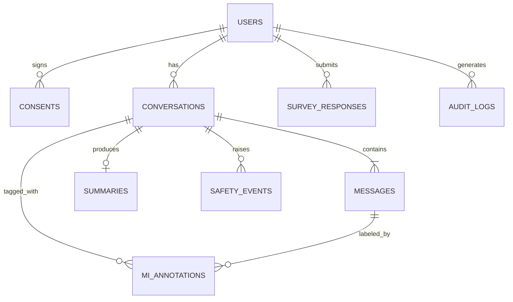

# MiraChat – HPV Vaccine Conversation Prototype

This prototype demonstrates a possible parent-facing interface for the **Digital Twin MI and HPV pilot**. It simulates a text-based motivational interviewing (MI) conversation about HPV vaccination using the **UF Navigator Toolkit** (`https://api.ai.it.ufl.edu`) and a system prompt.

It is **not a production clinical tool** and does not yet include:

- The approved RAG knowledge base
- The trained project model
- Study authentication / consent
- Survey data storage
- Production data handling, safety monitoring, or escalation

## What's in the prototype

- **Welcome screen** with AI disclosure, privacy notice, and clinical-use disclaimer
- **3-step flow** (Start → Discuss → Survey) with a progress indicator
- **Parent-facing chat** with quick-start concern chips, trust banner, and MI technique tags (Reflection, Affirmation, Ask-Offer-Ask, etc.) shown as small research labels
- **Conversation Goals panel** emphasizing autonomy and informed decision-making
- **Completion prompt** and **conversation summary** card after several turns
- **Mock acceptability / appropriateness / trust survey** (Likert + open-ended)
- **Research View** (stakeholder panel) showing conversation ID, model, RAG/MI fidelity/safety placeholders, deployment target, and survey status
- **Developer Settings** (hidden from parents) for model selection and system-prompt testing
- **Password gate** on the demo and server-side handling of the Navigator API key
- **Rate limiting** on `/api/chat`
- **API Docs & Data Model page** (`/docs`) sketching the planned production API surface, request/response shapes, an end-to-end flow diagram, and a Postgres ER diagram

## Important note on RAG

RAG grounding is **planned** for the production version. This prototype uses a prompt-based simulation only and does not yet ground medical claims in a verified knowledge base.

## Prototype boundary

This is a visual and functional prototype for stakeholder discussion. It is not the final Digital Twin system. Production versions would require approved model training, RAG grounding to verified HPV vaccine content, safety monitoring, authentication, study data storage, IRB-aligned consent language, and university-approved deployment.

## Planned architecture (see `/docs` in the app for full detail)

End-to-end flow:

Planned database schema:

Planned API surface (grouped):

- **Auth & Session** – `POST /api/auth/login`, `POST /api/auth/logout`, `GET /api/auth/me`
- **Consent** – `POST /api/consents`
- **Conversations** – `POST /api/conversations`, `GET /api/conversations/:id`, `POST /api/conversations/:id/messages` (SSE), `POST /api/conversations/:id/summarize`, `POST /api/conversations/:id/end`
- **Knowledge / RAG** – `GET /api/knowledge/search`, `POST /api/knowledge/ingest`
- **Safety** – `POST /api/safety/check`, `POST /api/safety/events`
- **Surveys** – `GET /api/surveys/:instrument`, `POST /api/surveys`
- **Research / Admin** – `GET /api/research/conversations`, `GET /api/research/metrics`, `POST /api/research/export`

The live, interactive version of these docs (with method badges and request/response shapes) lives at **/docs** in the running app.
